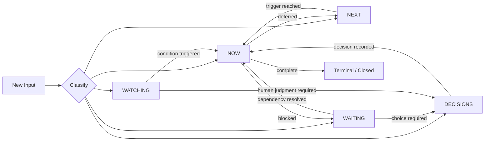
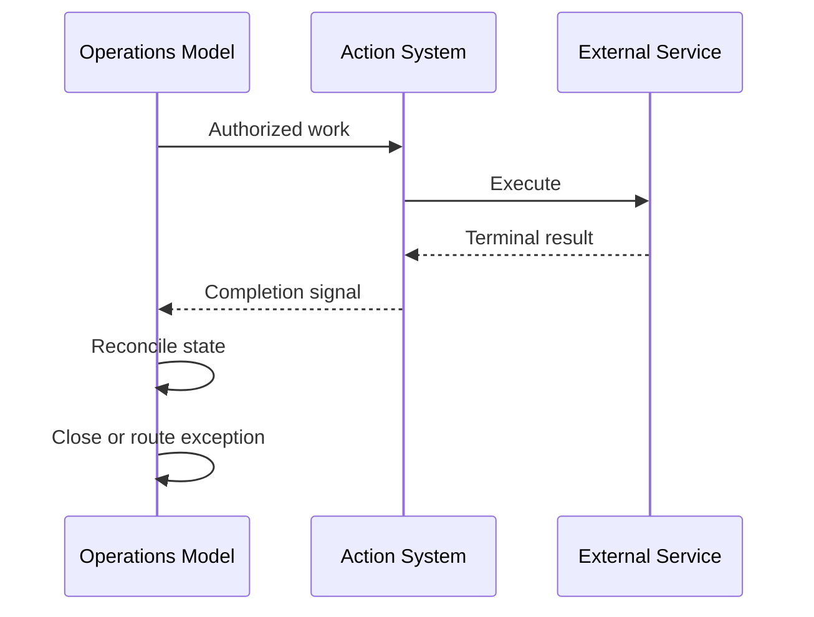

# AI Operations Situation Model

A lightweight state model for AI-assisted operations that separates immediate work, upcoming work, external dependencies, human decisions, and monitored conditions.

## Why This Exists

AI assistants are good at finding and generating information, but operational use creates a harder problem: **what deserves attention, who owns it, and what happens next?**

A flat task list does not distinguish between:

- work requiring action now;
- work that is valid but not yet due;
- work blocked by another person or system;
- decisions that exceed the AI system's authority; and
- conditions worth monitoring that do not justify action.

The Situation Model was designed to make those distinctions explicit.

## The Five States

| State | Meaning | Typical Exit |
| --- | --- | --- |
| **NOW** | Requires current attention or action | Completed, deferred, blocked, or escalated |
| **NEXT** | Legitimate upcoming work that is not yet current | Promoted to NOW when its trigger is reached |
| **WAITING** | Progress depends on an external person, event, or system | Dependency resolves, times out, or requires escalation |
| **DECISIONS** | A consequential choice requires authorized human judgment | Human decision is recorded and routed |
| **WATCHING** | Important condition should be monitored without immediate action | Threshold/event triggers NOW, DECISIONS, or closure |

## Core Design Principle

> Classification is not authority.

Knowing that something should happen does not mean the AI system is authorized to make it happen.

The model therefore separates **state** from **permission**. An item can be in NOW while still requiring human approval before an external or consequential action occurs.

## Lifecycle



State movement is event-driven. Items should not move merely because an AI agent "feels" they are more important.

## Minimum Item Contract

A useful operational item should carry enough information to answer:

```yaml
id: stable-item-id
summary: concise description
state: NOW | NEXT | WAITING | DECISIONS | WATCHING
owner: responsible role or human
next_action: explicit next step
authority: autonomous | approval-required | human-only
trigger: event, date, dependency, or threshold
source: where the item originated
last_verified: timestamp or verification marker
terminal_condition: what makes the item complete
```

The exact storage mechanism is implementation-dependent. The important point is that **owner, state, next action, authority, and completion criteria are explicit rather than inferred repeatedly.**

## Routing Logic

A simplified classifier can be expressed as:

```text
if consequential_choice_requires_human_authority:
    state = DECISIONS
elif blocked_by_external_dependency:
    state = WAITING
elif condition_matters_but_no_action_is_required:
    state = WATCHING
elif action_is_valid_but_trigger_is_future:
    state = NEXT
elif action_is_required_now:
    state = NOW
else:
    close_or_reject_item
```

Routing is intentionally conservative. Ambiguity should not silently expand system authority.

## Human-in-the-Loop Controls

The model supports autonomous work without treating autonomy as unlimited.

Examples of actions that may require a human gate include:

- commitments to customers or third parties;
- purchases or financial commitments;
- publication or external communication;
- destructive changes;
- permission or authority expansion; and
- decisions where business judgment materially changes the outcome.

The approval requirement belongs to the action contract, not to the language model's confidence.

## Reconciliation

One of the most important operational lessons from using the model was that **execution state and tracking state can diverge**.

Example:

1. A downstream system successfully completes an action.
2. The operational tracker never receives or processes the terminal event.
3. The item remains in NOW, WAITING, or an approval state.
4. The dashboard reports stale work even though execution succeeded.

This is a reconciliation failure, not necessarily an execution failure.

A robust implementation therefore checks for authoritative terminal signals and reconciles the Situation Model accordingly.



## Failure Modes Considered

### Stale State

The real-world action completed but the model still reports it as pending.

**Control:** terminal-state reconciliation and freshness checks.

### Duplicate Action

A stale pending state causes a completed action to be attempted again.

**Control:** stable identifiers, idempotency where possible, and completion verification before re-execution.

### Authority Drift

An AI agent interprets repeated approval as permission to make similar decisions independently.

**Control:** authority is explicit and does not expand through precedent.

### Orphaned Work

An item exists but has no clear owner or next action.

**Control:** active items require both fields; otherwise they are treated as malformed or routed for clarification.

### Premature Escalation

Routine work is repeatedly pushed to a human even though it falls inside established authority.

**Control:** escalation is based on authority, risk, commitment, and missing information rather than general uncertainty.

### Monitoring Becomes Work

WATCHING accumulates conditions that never need review or have no trigger.

**Control:** every monitored item needs a reason to exist and a defined condition that changes its state.

## Example

A customer-facing workflow might produce the following items:

| Event | State | Reason |
| --- | --- | --- |
| Customer asks for information already covered by an approved process | NOW | Action is current and within authority |
| Follow-up is due next Tuesday | NEXT | Valid work, future trigger |
| Proposal is awaiting customer response | WAITING | External dependency |
| Customer requests a scope change affecting price | DECISIONS | Requires authorized business judgment |
| External service has intermittent degradation but no current impact | WATCHING | Monitor until threshold is crossed |

The value is not the labels themselves. The value is that each state implies a different operational behavior.

## Design Lessons

### 1. State and authority are separate dimensions

An urgent task can still require human approval. A low-risk task can sometimes proceed autonomously.

### 2. "Waiting" is real operational state

Treating blocked work as active work creates noise and makes dashboards less trustworthy.

### 3. Terminal conditions matter as much as intake

AI workflow design often concentrates on starting work. Reliable operations also need an explicit definition of **done**.

### 4. Reconciliation is part of the workflow

A successful external action does not automatically mean every participating system knows it succeeded.

### 5. Humans should handle judgment, not routine bookkeeping

A useful AI operations system reduces unnecessary escalation while preserving human control over consequential decisions.

## Scope of This Repository

This repository is a **sanitized architecture case study** based on a system used in an applied AI operations environment.

It intentionally excludes:

- private system prompts;
- credentials and API configuration;
- customer or personal data;
- proprietary internal instructions; and
- production infrastructure details.

The purpose is to demonstrate the design problem, reasoning, controls, failure handling, and operational lessons rather than publish a production system.

## Related Portfolio Work

This case study is part of a broader applied AI portfolio covering:

- multi-agent business operations architecture;
- human-in-the-loop AI production pipelines; and
- practical AI workflow controls.

---

**William "Billy" VanVorst**  
Applied AI Systems & Automation  
Founder, bVan! Systems
