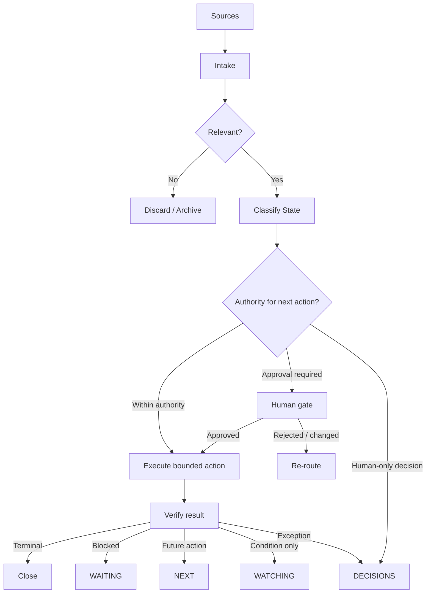

# Architecture Notes

## Design Goal

The Situation Model is intended to maintain a small, operationally meaningful representation of work without turning an AI assistant into an unrestricted decision-maker.

The architecture separates five concerns:

1. **Intake** — detect a potentially relevant event.
2. **Classification** — determine the operational state.
3. **Authority** — determine whether the next action is permitted.
4. **Execution or escalation** — perform bounded work or route a decision.
5. **Reconciliation** — verify the resulting state and close or reroute the item.

## Reference Flow

## Separation of Concerns

A common failure pattern in AI automation is collapsing classification, decision-making, and execution into one model call.

This design treats them as separate questions:

- **What is happening?**
- **What state does it belong in?**
- **Who has authority?**
- **What action is allowed?**
- **How will completion be verified?**

That separation makes failures easier to diagnose and reduces accidental authority expansion.

## Freshness

Operational state has a time dimension. An item that was correct yesterday may be wrong today.

Implementations should therefore distinguish:

- when the source event occurred;
- when the item was last evaluated;
- when the underlying condition was last verified; and
- when the next verification is required.

Freshness does not mean constantly polling everything. Verification cadence should reflect the cost and volatility of the underlying condition.

## Terminal Reconciliation

Terminal reconciliation exists because multiple systems can hold different representations of the same work.

A terminal signal should be:

- authoritative enough to trust;
- associated with the correct item;
- safe against duplicate processing; and
- capable of clearing or updating dependent state.

Where a reliable terminal signal is unavailable, the system should surface uncertainty rather than invent completion.

## Implementation Independence

The Situation Model can be implemented with a database, task system, event stream, structured document, or other persistence layer. This case study intentionally focuses on the operational contract rather than a specific vendor or framework.
